Adding more Things to our Platformer
====================================

**IMPORTANT NOTE:** *All graphics used in this tutorial were taken from the game "The Lost Vikings" (c) 1992 by Silicon and Synapse
(now Blizzard Entertainment Inc.). Please use these (in your own projects and repos) for demonstration purposes only and then mention this
copyright statement!*

Welcome back to the advanced spygame level-tmx tutorial, in which we will improve our level from the previous tutorial by adding more exciting things to
it. At the end of this process, our level will look like this:

.. image:: tutorial/advanced/001_final_spygame_game.png
    :alt: The final spygame game we will be building in this tutorial

All you need to follow along with the different steps in this tutorial is to copy your project directory from the previous tutorial
(with all its subdirectories and contents) and name the copy of the folder "tutorial_advanced". Alternatively, you can just keep working with the
already existing project and build all new things on top of it (you will lose some of the pieces of the previous tutorial, but what the heck).

Other than that, the same tools as for the first part are needed (Tiled editor, spygame lib, etc..).

Converting our Stairs into Slopes
---------------------------------

The first thing we would like to improve in our level is to get rid of the stairs-like structure and instead replace it with a smooth, sloped hill.
We open the tutorial.tmx file in our Tiled editor and go to the Layers panel.

**Note:** Make sure you have the
*View->Views and Toolbars->Tilesets/Objects/Layers/Properties/Main Toolbar/Tools* panels all checked to make these visible in your editor.

We go to the Layers panel and make all layers invisible, except for the collision layer and the background layer.
We will also move up the collision layer to the first position in the layers list for better visibility purposes by using the highlighted up-arrow in the image
below. Note that the position in the list of layers
in the Layers panel has no effect on the actual render order in the game. The render order is determined by the custom property render_order (int) for each
layer (that has do_render set to true) and defaults to a value of 50:

.. image:: tutorial/advanced/002_moving_layers_up_and_down.png
    :alt: Moving layers up and down

Note that we will now be able to nicely draw collision tiles on top of the background (without hurting the background).
Next, we select the collision layer in the Layers panel and then choose the eraser tool (E)
and erase the staircase in the middle of our level. The level should now look like this:

.. image:: tutorial/advanced/003_erasing_the_staircase.png
    :alt: Erasing the staircase of our level (to be replaced with a sloped hill)

In order to use sloped tiles (instead of the fully filled red square), we need to add slope-function properties also to the other tiles in the first row of our
generic tileset. Remember that we already defined such a function for the fully filled red square tile in the first part of the tutorial. We will
now define similar functions for all other red tiles. Starting with the 3rd tile in the first row (the 45° up-slope with ID=2) and then moving tile by tile
to the right, we define a custom "slope" and "offset" property for each of them by right clicking the respective tile, choosing "Tile Properties",
clicking on the plus symbol at the bottom of the Properties panel and then assigning the following values (remember that both "slope" and "offset" need to be
of type *float*):

====  =============  =========  =======
ID    Tile           slope      offset
====  =============  =========  =======
 2    45° up         1.0        0.0
 3    22° up (1)     0.5        0.0
 4    22° up (2)     0.5        0.5
 5    15° up (1)     0.33333    0.0
 6    15° up (2)     0.33333    0.33333
 7    15° up (3)     0.33333    0.66666
 8    45° down       -1.0       1.0
 9    22° down (1)   -0.5       1.0
10    22° down (2)   -0.5       0.5
11    15° down (1)   -0.33333   1.0
12    15° down (2)   -0.33333   0.66666
13    15° down (3)   -0.33333   0.33333
====  =============  =========  =======

Next, we will start drawing the slope where the stairs used to be. We start at the bottom with two tiles of slope 22°-up, then we continue til the top with
45° up-tiles. Try to make your level look like this. Remember to select the collision layer in the Layers panel before you draw the new sloped tiles:

.. image:: tutorial/advanced/004_creating_a_sloped_hill.png
    :alt: The new sloped hill

Also note the two solid squares (highlighted with a blue x). These are important so that the player will not be able to jump into the sloped tiles from the
back (from within the cave). This would lead to unpredicted behaviors and is currently not supported by spygame's platformer physics component.

This would be all for slopes. You can play around with the other sloped tiles and add any sloped structure you would like. The only restriction that spygame
currently poses are a) no entering sloped tiles from the back and b) no upside-down slopes (ceiling slopes). Support for these cases may be
added to spygame in the future.

Fixing the Foreground Layer and Preparing for Ladders
-----------------------------------------------------

The next thing we would like to do is to "fix" the foreground layer. Right now, the only thing in this layer is the palm tree. We will make the sloped hill
look nicer with the player moving up the hill as well as prepare for the palm tree to act as a ladder on which the player can climb using the
up and down arrow keys.

We make the foreground layer visible, click on it in the Layers panel and use the eraser tool to remove the palm tree. Then we make the collision layer
invisible, click on the background layer in the Layers panel and use the rectangular selection tool (R) to block-select
the following range of (background) tiles:

.. image:: tutorial/advanced/005_selecting_a_range_of_tiles.png
    :alt: Selecting a range of tiles from a layer

Then we press CTRL+X to cut this range of tiles. We then select the foreground layer again in the Layers panel, press CTRL+V and insert the cut tiles now into
the foreground layer.
If we play the game now (run the copied tutorial.py from within the new copied directory), we can see that Erik will now a) be able to walk up the hill
without having to jump thanks to the sloped tiles and b) disappear nicely behind the sandy slopes of the hill because these tiles are now part of the
foreground layer.
We also - sadly - note that the palm tree has been removed. However, we will plant it back now and - even better than before - make a ladder out of it!

.. image:: tutorial/advanced/006_erik_disappearing_nicely_in_the_foreground_sand_hill.png
    :alt: Erik half sunken in the sand

Adding Ladders to the Levels
----------------------------

Ladders in spygame are quite easy to do. They are simply "painted", meaning they are an integral part of a background layer (of any other layer).
Any tile or group of tiles in any tileset can serve as a ladder. All we have to do is declare a special custom property on the respective tile and then
tell the layer (via yet another custom property) that it should look for ladder tiles to build the spygame.Ladder objects from these.

Here is how this works:
Select the egpt tileset in the Tilesets panel and look for any palm tree. Maybe the one we removed before, but any other will do just as well.
In the egpt tileset, select those tiles that make up the trunk of the palm tree. In the egpt case, this selection should be 2 tiles wide, but other
tilesets may offer ladder tiles of only one tile width. Your selection should look like this:

.. image:: tutorial/advanced/007_selecting_tiles_that_make_up_trunk.png
    :alt: Selecting a bunch of tiles that make up the trunk of a palm tree

Then right click this selection and choose "Tile Properties". This will allow us to set custom properties for all the different tiles in the selection
at the same time. We will add the property "autobuild_class" (string) and set its value to "spygame.Ladder".
Make sure that every single tile has this property now by clicking tile by tile through the palm tree trunk and checking in the Properties panel for
"type" set to "ladder". Next we need to use the brush tool (B) to paint the entire palm (not just the trunk) to the background layer:

.. image:: tutorial/advanced/008_re_adding_the_palm_to_the_background.png
    :alt: Re-adding the palm tree - this time to the background layer

You could have done the painting step before setting the tile properties (autobuild_class=spygame.Ladder).
Once you set or change a tile's properties, it will automatically apply to all already placed tiles in all existing layers.

The last thing we need to do is tell the background layer that it should look for ladder tiles when the layer builds itself (during the construction of the
spygame.TiledTileLayer object) and add spygame.Ladder objects for all consecutive tiles of autobuild_class=spygame.Ladder it can find.
This is a fully automated process and all we have to do is set a single custom property in the background layer,
named "autobuild_objects" (bool) and set its value to true.

If we now play the tutorial.py game, Erik should be able to climb up and down the trunk of the palm tree (using the up and down arrow keys):

.. image:: tutorial/advanced/009_erik_climbing_up_a_ladder.png
    :alt: Erik climbing up the palm tree's trunk

**Exercise:** There are two tiles in the egpt tileset that look like an actual ladder. Can you find them, convert them into ladder
tiles and add a real-looking ladder to your level via the background layer's build_ladder capabilities? Do it the exact same way as we did with the
palm tree trunk.

Next up: Building our first trap into the depth of our mean-ass pharaoh temple.

Adding Dangerous Quicksand to the Level
---------------------------------------

Liquid surfaces like water or quicksand that cause the player to sink and die can be added to a level in the same way as ladders.
This time, however, we will add the respective tiles to the foreground layer (ladders are usually added to the background layer as the player
is rendered in front of the ladder).
We select all tiles in the egpt tileset that look like quicksand. These are the tiles with the IDs 320, 321, 322, 360, 400, 401, 440, 441, and 481. We can
select all of them at the same time using the mouse and the CTRL key. Then we click on the plus sign in the Properties panel and add the property:
"autobuild_class" (string) with the value "spygame.LiquidBody".
We then paint (into the foreground layer) the following structure:

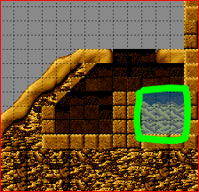

Playing the tutorial.py game should now make Erik die when touching the surface of the quicksand. Let try it out:

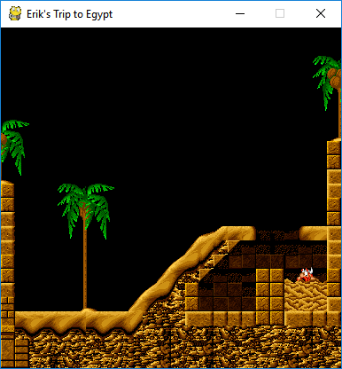

The game should end here printing out "Game Over" on the console.

Adding a Repeater for even more of a 3D Effect
----------------------------------------------

The next item we are going to add will be very simple but quite effective. We will use a so-called repeater object. A Repeater in spygame is a kind of
super-background. It will be rendered with a render_order of 0 (remember the background layer had a value of 10 here). Also, if the level is a little larger
and you specify a width and height parameter in the constructor of the spygame.Game object, you will be able to see that there is a viewport that follows
the active character around in the level. During the scrolling of that viewport, the repeater scrolls along, but at a slightly different speed (should be
slower) so that a pseudo-3D effect arises out of this. Let's try it out:

1. We will change the call to the Game constructor in tutorial.py to add the two parameters width=200 and height=200:

.. code-block:: python
    :linenos:
    :lineno-start: 4

    # create a spyg.Game object
    game = spyg.Game(screens_and_levels=[
        # the only level
        {
            "class": vik.VikingLevel, "name": "TUTORIAL", "id": 1,
        },

        # add more of your levels here
        # { ... },

    ], width=200, height=200, title="Erik's Trip to Egypt")

2. We need to insert the repeater object into the level:
   The following will make clear that the inserted object tiles (the ones that go into the tiled object layer in the level-tmx file), have nothing
   to do with the images actually being rendered in the spygame level. We use these particular images in the Tiled editor only to get a better picture of
   what the level will look like in the end. So choose any tile you like from any tileset you like and place this tile once into the object layer as a
   new object
   (I chose the fully filled red square from the generic tileset). Place it all the way in the top left corner of the level:

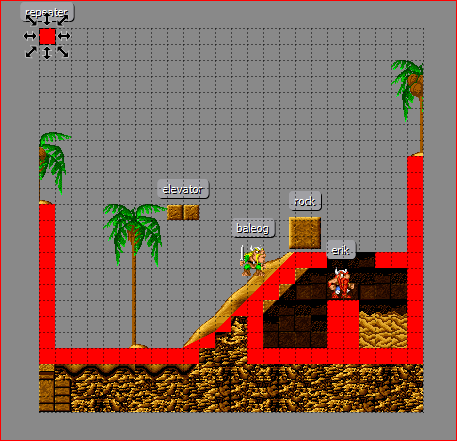

3. ... and assign the following properties to the new object:

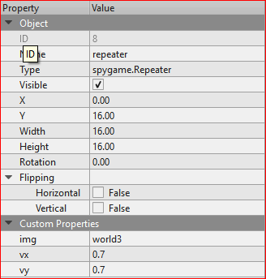

Now, let's try the level again. You should see that when Erik jumps for example, the repeater super-background scrolls a little slower than the rest of the
level (the background and foreground tiled layers). You can play around with the vx and vy parameters in the Repeater's constructor (use values between
0.25 and 1.0 in the custom properties of the repeater object).
1.0 here means scroll just like the regular layers (no extra pseudo 3D effect). Values larger than 1.0 will look physically
counter intuitive as the super-background (which is supposed to be further away) will scroll faster than the tiled layers.

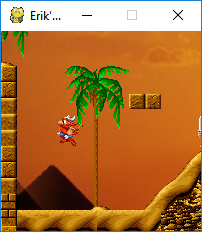

    What a ready spygame.Repeater object will look like.

When you are done testing, please set the width and height of the Game back to "auto" (meaning: remove the parameters from the function call).
For the following, we would like to see the entire level again, not just a section of it.

Adding an Additional Viking to the Level
----------------------------------------

Now that we have the nicely sloped hill, we no longer rely on our hero being able to jump up the stairs. One can just walk. Therefore Vikings other
than Erik, who are not able to jump (but have other qualities) can enter the scene now. So let's add Baleog the Fierce, a fearless warrior with sword and
bow.

We have to add a new tileset first, the one for Baleog. Click on *Map->New Tileset*, then pick the baleog.png file and make sure the width and height are 32px
each. Click the little "Export Tileset As" button at the bottom of the Tilesets panel and save the Baleog tileset as "baleog.tsx" in the data/ directory
of your project. Select the object layer and - with the Insert Tile (T) tool - insert one Baleog object into the level.
Switch to the Select Tool (S) and click on the newly inserted Baleog, then set his Type property to "spygame.examples.vikings.Baleog".

There is one more thing we have to do before we can fully utilize Baleog's capabilities. Baleog can hit with his sword (using space) and shoot an arrow
with his bow (by pressing D). Also, only one of the two vikings (Erik or Baleog) can be played at a given time. To switch between the vikings during
the game, we will use CTRL. These keys are defined inside the spygame.examples.vikings classes and we will - in a later tutorial - talk about
what these classes look like and go through their code. However, to simply make spygame listen to these keys for now, we need to add them to our
keyboard_inputs list in the tmx file's properties. Click on *Map->Map Properties* and change the value of the keyboard_inputs variable to be
"up,down,left,right,space,rctrl,lctrl,d". Lctrl and rctrl stand for the left control key and the right control key, respectively.

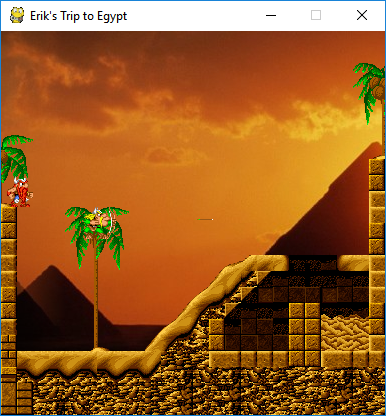

**Exercise:** Can you find out about the third viking (Olaf) and try to add him to the level as well? Try to use the exact same steps as for Baleog.
Olaf does not need any more keyboard_inputs settings. He can only use the space bar, which will cause him to switch between his shield being up (above
head) or down (in front of him).

In the next paragraph, we will add a movable rock to the level, which can be pushed back and forth by the vikings and which one has to be
careful not to push above some viking's head (that would be really bad!).

Adding a Movable Rock
---------------------

Movable rocks are spygame objects that obey similar physics laws than our Vikings. In fact, internally they use the exact same physics component as our heroes.
In this physics component, the settings is_heavy and is_pushable are set to True and thus they have the characteristic to a) be pushable (also up and down
slopes) and b) squeeze things beneath them (for example our vikings).

Let's add the graphics to our tmx file (a new sprite sheet) and then place one movable rock into our level.

Click on *Map->New Tileset* and choose the "movable_rock.png" file, then setup the tileset with a tile width and height of 32px each:

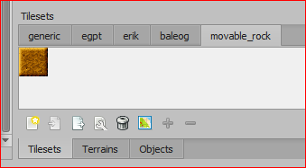

Click on the object layer in the Layers panel, then select the only tile in the movable_rock tileset and press T to activate the "Insert Tile" tool.
Click somewhere in the level to place one rock object, then press S for "Select Object" and set the rock's Type to "spygame.MovableRock".

When you play the level, you should now be able to push the rock with either Erik or Baleog, uphill and downhill, only being blocked by another viking or
a wall on the other side of the rock:

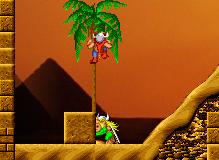

    Baleog pushing the movable rock object

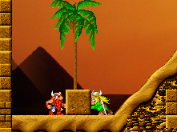

    Erik blocking Baleog from pushing the movable rock object

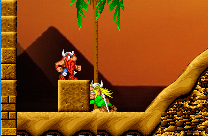

    Baleog pushing the movable rock object with Erik standing on top (and moving along with the rock)

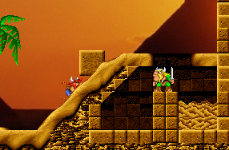

    Erik pushing the Rock uphill

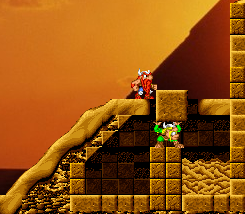

    Poor Baleog getting squeezed by the rock

You see, there are many cool things to do with rocks (well, don't ask Baleog for his opinion on the last stunt). In the next paragraph, we will explore
elevators and moving platforms.

Adding an Elevator
------------------

Spygame also comes with moving platforms (or elevators). At this stage of spygame development, these can either move in up/down (y) or left/right direction (x).
The two extreme points, where the elevator will revert its speed and start moving into the other direction, have to be specified at
construction time.

We create yet another tileset for the elevator image in our level-tmx file. Click on *Map-> New Tileset* and browse for the elevator.png image in the images/
folder of the project. **Important:** Set the width to 32px and the height to 15px (not 16!). These are the dimensions of the image and the image will thus
only yield a single tile. We use that single tile and the Insert Tile (T) tool (remember to click on the objects layer first), as well as the Select Objects (S)
tool to place an elevator into the level and set its Type property to "spygame.Elevator" (you can also give it a descriptive Name property , like "elevator"):

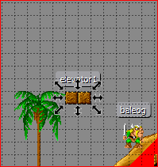

Also, create the following custom properties on the elevator object:

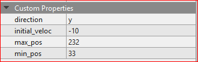

This specifies that the elevator will move in up/down direction with a speed of 10 and will turn around at the extreme points y=33 and y=232.
Let's try it out. Erik can jump on top of the elevator from the palm tree or from the hill, Baleog should be able to "jump" onto the elevator from the top
of the palm tree, but only if you make that tree a little higher:

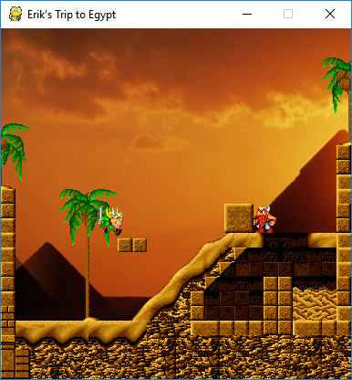

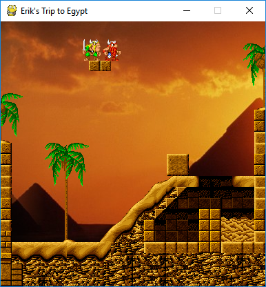

Adding a Fire Spitter
---------------------

Let's do something mean again and this time add a fire spitter to the level. After all, we are in a pharaoh temple in old egypt and thus expect to see
many traps and pitfalls. The FireSpitter class comes with the examples.vikings package of spygame and is yet another autobuild object (just like Ladder
and LiquidBody), which means it gets created automatically via a) the background layer being set to autobuild_objects=true and b) some tiles (in the
background layer) having an autobuild_class defined (in this case, "spygame.examples.vikings.FireSpitter").
However, what's new to learn here is that besides the
autobuild_class specification, we can always set further parameters that we would like to send to the FireSpitter (or any other Autobuild)
constructor. The FireSpitter constructor takes an optional "direction" parameter (shooting left or right)
and a "frequency" parameter (shooting frequency in 1/sec). To specify these in
the level-tmx file, we have to create them as custom properties of the tile.

Look for the two tiles that look like fire spitters in the egpt tileset. They are marked with a blue X in the image below:

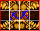

Now select both of them and set their autobuild_class to "spygame.examples.vikings.FireSpitter". Also give both of them another new custom property
called "P_frequency" (float) and set the value to 0.3. Then select only the left one and create the new custom property "P_direction" (string) = "left" and
do the same for the right fire spitter ("P_direction" (string) = "right"). You can see that additional parameters to the autobuild constructors
must have a preceding "P\_" so that spygame recognizes these as autobuild c'tor parameters:

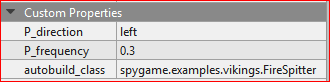

We also have to separate the egpt tileset from the tmx file by exporting it as tsx (to have the tsx available for the fire ball sprite animation).
Therefore, we save the egpt tileset as "egpt.tsx" in the data/ directory.

The last thing we have to do is to place a fire spitter into the level-tmx. We will place it into the background layer (it's already setup to autobuild,
so that's good). Paint a fire spitter nicely above the quicksand pool like this:

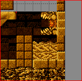

Note that all tiles other than the one in the center of the spitter are meaningless background tiles. Only the glowing in the center of the mouth
is the one that triggers the autobuild with the correct constructor parameters (frequency and direction).

Try it out. If a viking gets shot now by a fire ball, it will be in pain and move a little away from the collision from the impact:

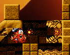

**Note:** There is no damage handler implemented yet on the viking characters, so they can currently fall, get bitten by a monster or get hit
by a fire ball without any consequences. The only thing they can die from is by jumping into the quicksand pool. This is all still work in progress.

The last thing in this tutorial will be adding a monster to the level. We will let you decide whether it's going to be a poison shooting scorpion or a
mean, biting dinosaur.

Adding Monsters
---------------

In this last part of our tutorial, we will finally add some enemies to our level. Thereby you can choose between a dinosaur and a scorpion.

