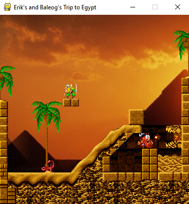
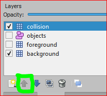
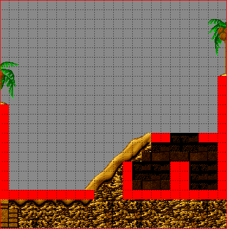
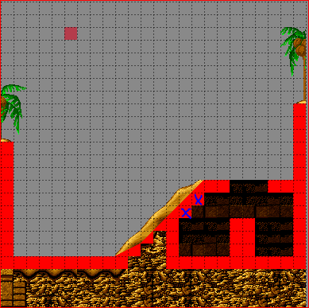
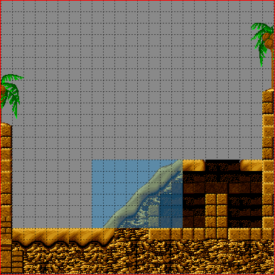
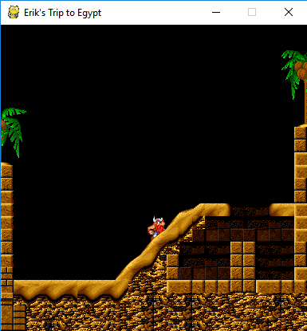
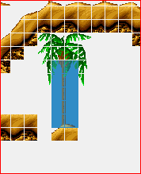
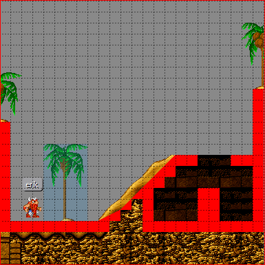
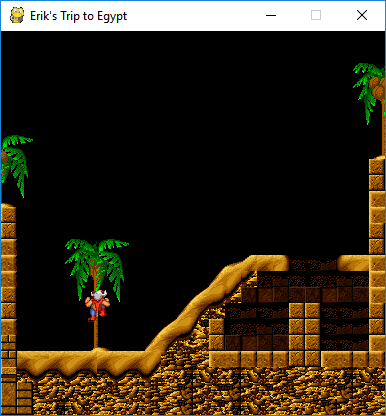

Adding more Things to our Platformer
====================================

**IMPORTANT NOTE:** *All graphics used in this tutorial were taken from the game "The Lost Vikings" (c) 1992 by Silicon and Synapse
(now Blizzard Entertainment Inc.). Please use these (in your own projects and repos) for demonstration purposes only and then mention this
copyright statement!*

Welcome back to the advanced spygame level-tmx tutorial, in which we will improve our level from the previous tutorial by adding more exciting things to
it. At the end of this process, our level will look like this:

All you need to follow along with the different steps in this tutorial is to copy your project directory from the previous tutorial
(with all its subdirectories and contents) and name the copy of the folder "tutorial_advanced". Alternatively, you can just keep working with the
already existing project and build all new things on top of it (you will lose some of the pieces of the previous tutorial, but what the heck).

Other than that, the same tools as for the first part are needed (Tiled editor, spygame lib, etc..).

Converting our Stairs into Slopes
---------------------------------

The first thing we would like to improve in our level is to get rid of the stairs-like structure and instead replace it with a smooth, sloped hill.
We open the tutorial.tmx file in our Tiled editor and go to the Layers panel.

**Note:** Make sure you have the
*View->Views and Toolbars->Tilesets/Objects/Layers/Properties/Main Toolbar/Tools* panels all checked to make these visible in your editor.

We go to the Layers panel and make all layers invisible, except for the collision layer and the background layer.
We will also move up the collision layer to the first position in the layers list for better visibility purposes by using the highlighted up-arrow in the image
below. Note that the position in the list of layers
in the Layers panel has no effect on the actual render order in the game. The render order is determined by the custom property render_order (int) for each
layer (that has do_render set to true) and defaults to a value of 50:

Note that we will now be able to nicely draw collision tiles on top of the background (without hurting the background).
Next, we select the collision layer in the Layers panel and then choose the eraser tool (E)
and erase the staircase in the middle of our level. The level should now look like this:

In order to use sloped tiles (instead of the fully filled red square), we need to add slope-function properties also to the other tiles in the first row of our
generic tileset. Remember that we already defined such a function for the fully filled red square tile in the first part of the tutorial. We will
now define similar functions for all other red tiles. Starting with the 3rd tile in the first row (the 45° up-slope with ID=2) and then moving tile by tile
to the right, we define a custom "slope" and "offset" property for each of them by right clicking the respective tile, choosing "Tile Properties",
clicking on the plus symbol at the bottom of the Properties panel and then assigning the following values (remember that both "slope" and "offset" need to be
of type *float*):

====  =============  =========  =======
ID    Tile           slope      offset
====  =============  =========  =======
 2    45° up         1.0        0.0
 3    22° up (1)     0.5        0.0
 4    22° up (2)     0.5        0.5
 5    15° up (1)     0.33333    0.0
 6    15° up (2)     0.33333    0.33333
 7    15° up (3)     0.33333    0.66666
 8    45° down       -1.0       1.0
 9    22° down (1)   -0.5       1.0
10    22° down (2)   -0.5       0.5
11    15° down (1)   -0.33333   1.0
12    15° down (2)   -0.33333   0.66666
13    15° down (3)   -0.33333   0.33333
====  =============  =========  =======

Next, we will start drawing the slope where the stairs used to be. We start at the bottom with two tiles of slope 22°-up, then we continue til the top with
45° up-tiles. Try to make your level look like this. Remember to select the collision layer in the Layers panel before you draw the new sloped tiles:

Also note the two solid squares (highlighted with a blue x). These are important so that the player will not be able to jump into the sloped tiles from the
back (from within the cave). This would lead to unpredicted behaviors and is currently not supported by spygame's platformer physics component.

This would be all for slopes. You can play around with the other sloped tiles and add any sloped structure you would like. The only restriction that spygame
currently poses are a) no entering sloped tiles from the back and b) no upside-down slopes (ceiling slopes). Support for these cases may be
added to spygame in the future.

Fixing the Foreground Layer and Preparing for Ladders
-----------------------------------------------------

The next thing we would like to do is to "fix" the foreground layer. Right now, the only thing in this layer is the palm tree. We will make the sloped hill
look nicer with the player moving up the hill as well as prepare for the palm tree to act as a ladder on which the player can climb using the
up and down arrow keys.

We make the foreground layer visible, click on it in the Layers panel and use the eraser tool to remove the palm tree. Then we make the collision layer
invisible, click on the background layer in the Layers panel and use the rectangular selection tool (R) to block-select
the following range of (background) tiles:

Then we press CTRL+X to cut this range of tiles. We then select the foreground layer again in the Layers panel, press CTRL+V and insert the cut tiles now into
the foreground layer.
If we play the game now (run the copied tutorial.py from within the new copied directory), we can see that Erik will now a) be able to walk up the hill
without having to jump thanks to the sloped tiles and b) disappear nicely behind the sandy slopes of the hill because these tiles are now part of the
foreground layer.
We also - sadly - note that the palm tree has been removed. However, we will plant it back now and - even better than before - make a ladder out of it!

Adding Ladders to the Levels
----------------------------

Ladders in spygame are quite easy to do. They are simply "painted", meaning they are an integral part of a background layer (of any other layer).
Any tile or group of tiles in any tileset can serve as a ladder. All we have to do is declare a special custom property on the respective tile and then
tell the layer (via yet another custom property) that it should look for ladder tiles to build the spygame.Ladder objects from these.

Here is how this works:
Select the egpt tileset in the Tilesets panel and look for any palm tree. Maybe the one we removed before, but any other will do just as well.
In the egpt tileset, select those tiles that make up the trunk of the palm tree. In the egpt case, this selection should be 2 tiles wide, but other
tilesets may offer ladder tiles of only one tile width. Your selection should look like this:

Then right click this selection and choose "Tile Properties". This will allow us to set custom properties for all the different tiles in the selection
at the same time. We will add the property "type" (string) and set its value to "ladder".
Make sure that every single tile has this property now by clicking tile by tile through the palm tree trunk and checking in the Properties panel for
"type" set to "ladder". Next we need to use the brush tool (B) to paint the entire palm (not just the trunk) to the background layer:

You could have done the painting step before setting the tile properties (type=ladder).
Once you set or change a tile's properties, it will automatically apply to all already placed tiles in all existing layers.

The last thing we need to do is tell the background layer that it should look for ladder tiles when the layer builds itself (during the construction of the
spygame.TiledTileLayer object) and add spygame.Ladder objects for all consecutive tiles of type=ladder it can find. This is a fully automated process
and all we have to do is set a single custom property in the background layer, named "build_ladders" (bool) and set its value to true.

If we now play the tutorial.py game, Erik should be able to climb up and down the trunk of the palm tree (using the up and down arrow keys):

**Exercise:** There are two tiles in the egpt tileset that look like an actual ladder. Can you find them, convert them into ladder
tiles and add a real-looking ladder to your level via the background layer's build_ladder capabilities? Do it the exact same way as we did with the
palm tree trunk.

Next up: Building our first trap into the depth of our mean-ass pharao temple.

Adding Dangerous Quicksand to the Level
---------------------------------------

In order to add either quicksand or water surfaces into your levels, you need to paint
