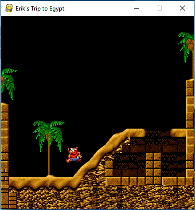

How to build a Platformer with spygame
======================================

**IMPORTANT NOTE:** *All graphics used in this tutorial were taken from the game "The Lost Vikings" (c) 1992 by Silicon and Synapse
(now Blizzard Entertainment Inc.). Please use these (in your own projects and repos) for demonstration purposes only and then mention this
copyright statement!*

In this tutorial, we will be building a 2D platformer level from scratch using the spygame library. It will look roughly like this:

In the game, we will be able to control Erik the Swift via the arrow keys and the space bar (to make him jump).

You will need the following simple prerequisites to follow along with the different steps in this tutorial:

- The "Tiled" editor to create spygame's level-tmx files. A level-tmx file contains all necessary information for spygame to build a complete level, i.e.
  background and foreground graphics, objects that the level will start with (e.g. player, enemies, traps, elevators, ladders, etc..).
  You can download `Tiled from here <http://www.mapeditor.org>`_.
- The spygame library: See our `Quick Setup Instructions <readme_link.html#get-the-code>`_ for all necessary details on how to get and install spygame.
- Some asset files: Download the following two folders into the directory, in which you would like to develop the game. This will be the directory, in
  which we will write the tutorial.py file (the only python file we are going to create and write to in this tutorial).

  a) images/ (`from here <https://github.com/sven1977/spygame/tree/master/examples/tutorial/images>`_)
  b) data/ (you can create this as an empty directory; we'll be populating it from scratch with a level-tmx and some tsx (spritesheet) files)

Level tmx-files
---------------

Our first step in building a platformer will be to create the level as a so called level-tmx file. A level-tmx file is nothing other than a regular
tmx file (which is a type of xml) that can be opened and edited with the Tiled editor. However, spygame level-tmx files additionally support certain
spygame specific custom properties that can be used to tweak the behavior and look of a level.

Let's start by opening the Tiled editor. We click on *File->New*

.. image:: tutorial/002_file_new.png
    :alt: Create a new level-tmx file

We specify our tile settings to be 24x24 tiles, with 16x16px for each tile.

This is what our empty level should now look like:

.. image:: tutorial/004_empty_level.png
    :alt: An empty level-tmx file ready to be populated
    :scale: 50%

We click on *File->Save As* and store the newly created tmx file in the data/ directory of our project folder as "tutorial.tmx". This is the only file that
should be in the data/ directory right now.

.. image:: tutorial/005_file_save_as.png
    :alt: Chose a filename for your new level-tmx file

Layers
------

**Important Note:** For the following, make sure you have the
*View->Views and Toolbars->Tilesets, Objects, Layers, Properties, Main Toolbar, and Tools* all checked to be able to see your new tileset (and some
other things we need later) in the editor.

It's time to work on our first layer of our level. A layer is a group of tiles that all have a common purpose and
that - if the layer is visible - get rendered at the same time.
The most commonly used layers in a level are "collision layer", "background layer", and "foreground layer".
The collision layer is usually not visible (not rendered), the background layer usually gets rendered first, followed by the game objects
(the player, enemies, etc..) and the foreground
layer, which gets rendered last (so it's in the foreground).

There should already be one layer in the just saved tmx file, called "Tile Layer 1". We will rename this layer now to "collision" by double clicking the
layer in the Layers panel.

In order to place tiles into the layer, we have to first generate one or more tilesets:

Tilesets
++++++++

The tileset we will create first and then setup is a generic tileset that we will use to build our collision layer.
The tiles in this layer will not be rendered in the game.

Creating new Tilesets from png Files
************************************

We click on *Map->New Tileset* and then on the *Browse* button to select an image that we will turn into a tileset.

.. image:: tutorial/006_map_new_tileset.png
    :alt: Creating a new tileset from scratch

A tileset is simply an image file that can be further split (horizontally and vertically) into "tiles". For example:

.. image:: tutorial/007_tileset_ready_png_image.png
    :alt: A png file that's ready to become a tileset
    :scale: 40%

From the images/ folder in our project, we now select the generic.png file and click on *Open*.

We will leave the *Tile width/height* settings at 16px each (this will be the size of all our tiles used for layers in this level) and click on *OK*.
We should see the following now in the Tilesets panel. Our new tileset has 18 usable tiles including the very first empty one. The tiles on the first
row we will use to create walls and (sloped) floors. The tiles in the second row exist for other purposes (like defining a watery surface, an exit, etc..).

Modifying Tilesets and Adding Properties to Single Tiles
********************************************************

Next, we will add some properties to some of the tiles in the "generic" tileset so that spygame can recognize these tiles as proper collision tiles
and make sure its physics engine gets the idea of walls, floors and slopes (slopes will be covered only in the next tutorial).

If you right click on a tile, you can select *Tile Properties* and then you see in the Properties panel that the tile already has the fixed properties
ID, width and height. Width and height should both be 16, since this is the size we chose when generating the tileset from the png file.
We won't really care about the ID property here - or at any later time.

.. image:: tutorial/009_changing_single_tiles_properties.png
    :alt:

We right click on the full red square tile and then click on the plus symbol in the properties panel to add a new custom property. We will call the
property *slope* and set its type to *float* and its value to *0.0*. We add another property called *offset* (again: *float*) and set its value
to *1.0*. These two
values basically describe the slope function for that tile. The slope function returns a y value (vertical axis) for each x-axis (horizontal axis) value.
X-axis values start from 0.0 at the very left edge of the tile and go to 1.0 at the very right edge of the tile.
For example, for a fully filled tile, the slope function would be y=0x+1, where 0 is the slope (no slope, no change in y-value dependent on x-value)
and an offset (y-axis intersection) of 1.
A 45° up-slope would therefore have the values slope=1.0 and offset=0.0 (y=x). A 45° down-slope would look like slope=-1.0 and offset=1.0 (y=-x+1), etc..
This way, we are able to define any arbitrary slopes.

.. image:: tutorial/010_adding_the_offset_property_to_a_tile.png
    :alt:

We will later add custom properties also to the other tiles in the *generic* tileset (when we talk about slopes in the next tutorial),
but for now, the fully filled red square will be enough to get us started. It will allow us to create a floor, walls and some simple stairs-like structure.

The Collision Layer
+++++++++++++++++++

The collision layer defines the location of walls and floors of our level. The players - and usually also the enemies - will collide with the single tiles
of this layer and thus cannot cross the barriers defined by it. This is where we will start: We will paint the floors and walls that make up our level.

Press *B* to activate the stamp brush tool (make sure the red square tile is still selected in the "generic" tileset in the Tilesets panel).
Paint a floor at the bottom of the level just like this:

.. image:: tutorial/012_drawing_a_floor.png
    :alt:

Then paint a wall, some stairs, a hole and other structures like this (still only using that one red square tile):

.. image:: tutorial/013_walls_and_other_structures.png
    :alt:

Finally, we need to let spygame know that the layer is a collision layer. Therefore, we will create a custom property on the layer itself
(not on any tiles in a tileset!). We single click on the
"collision" layer in the Layers panel and then on the plus symbol in the then showing layer properties in the Properties panel. This adds a new custom property
to the layer. We will call the property "type" (string) and give it a value of "default".
The type property for layers (as well as - later - objects), determines the collision behavior or our spygame game objects. And "default" here just means,
well, normal, like a wall or a floor are normal things to collide with. We will later get to know the types "friendly", "one_way_platform", "dockable",
"particle" and many other custom ones that we can define (and combine with each other) ourselves.

Also, by default, all layers in a level-tmx file will be rendered by spygame. Since we don't want to see any collision tiles in the final level, we
need to set the "do_render" custom property to false. We do this by adding yet another property (click the plus button), select type *bool*, name the
new property "do_render" and then make sure to un-tick the check box (to set it the value to false).

And this concludes our collision layer. Next, we'll add some nicer background and foreground graphics to our level.

The Background Layer
++++++++++++++++++++

Let's do the background layer next.

We click on *Layer->New->Tile Layer* and rename the newly created layer in the Layer panel to be called "background".

.. image:: tutorial/014_background_layer.png
    :alt: The background layer

This time, we will not add a "type" property to the layer as the type will default to "none" (or 0), which means the layer won't be considered for
any collisions. However, we do need to set the "do_render" (bool) property and set it to true (tick the box next to the newly created property).
We also need to specify a "render_order" (int) property and we will set that to 10 to make our background render quite early. The "do_render" tells spygame
that a layer should be rendered (the default for layers is
false (remember the collision layer, which was not rendered and where we didn't have to set anything)).
The "render_order" is just an int that defines the order in which a rendered layer object should be rendered. The lower the render_order, the earlier the
object gets rendered. Values can be chosen freely, but should be between 0 and 100, in order to keep some convention.

.. image:: tutorial/015_properties_of_background.png
    :alt: The customer properties of the new background layer

Next, we paint the details of the layer and therefore we will need another tileset (we need nicer tiles than the ones in the the "generic" tileset).
We create a new tileset (just like we did before with the "generic" tileset) based on the egpt.png file in the images/ folder:

.. image:: tutorial/016_the_egpt_tileset.png
    :alt: The egpt tileset

Make sure the background layer (and not the collision layer) is selected.
By selecting more than one tile in the new egpt tileset (Tilesets panel), you can create a larger brush and paint the level in fewer steps utilizing the
already given relations between the different tiles in the tileset. E.g.:

Using the brush tool (press B) and maybe the eraser tool (press E), we can now draw our background layer. I recommend moving the background layer on top of
the collision layer in the Layers panel to be able to draw over the collision layer (and make the collision layer slowly disappear behind the new background
tiles). Don't worry, since you have selected the background layer, you will not erase anything in the collision layer. Only the currently selected
layer gets changed.
Try to draw a background like the one in the image below:

Your background doesn't have to look exactly like the one above. Remember that the background is solely for graphical purposes.
It won't have any effect on collisions, wall-, or obstacle design. This concludes the work on our background layer.
Next, we will add a palm tree to a new foreground layer to create the effect of the player moving behind the tree.

The Foreground Layer
++++++++++++++++++++

We will now create yet another new layer similar to the background layer. Click on *Layer->New->Tile Layer* and rename the newly
created layer into "foreground".
Then click on the foreground layer in the Layers panel and create the custom properties: do_render(bool)=true as well as render_order(int)=100.
100 Makes sure that the foreground is rendered last. Everything we create now with render_order between 10 (background) and 100 (foreground) will seem
to be between these two layers and allow us to create the typical pseudo 3D effect of all 2D platformer games (we will later even add a so
called "repeater", which will strengthen the pseudo 3D effect even more).

Make sure the foreground layer is selected in the Layers panel and select any palm tree you like from the egpt tileset, then brush the palm onto our
foreground:

.. image:: tutorial/019_a_possible_foreground_setup.png
    :alt: A possible foreground setup could look like this

This concludes all our tiled tile layers (collision, back- and foreground). Next we will introduce a new type of layer, the so called "tiled object layer".
These allow us to populate our level with game objects, like the player, enemies, elevators, etc..

The Object Layer
++++++++++++++++

An object layer, also sometimes referred to as "tiled object layer" is a lose collection of one or more objects each of which can be represented by a single
tile. The tiles (objects) in an object layer are not nicely aligned horizontally and vertically as it is the case in tiled tile layers (e.g. the background).
The positions of the objects are rather freely settable by the designer.

Let's create our object layer and populate it with a first single object, the player.

We click on *Layer->New->Object Layer* and rename the new layer into "objects". Object layers do not require any custom properties. Instead, we will set
properties directly on the objects with which we populate the object layer (see below).

Then it's time to create a new tileset for our player hero.
We click on *Map->New Tileset* and chose the erik.png image file as the source for the new tileset. However, this time - before clicking on *OK* - we need
to set the tile width and height parameters to 32px (not 16px!):

.. image:: tutorial/021_setting_up_the_erik_tileset.png
    :alt: Settings for the erik.tsx tileset

We make sure that the new object layer is selected in the Layers panel and
click on the very first tile in the erik tileset (the one where Erik is not doing really anything special). Then by clicking in the toolbar at the top on the
"Insert Tile" tool (or by pressing T) and by clicking anywhere in the level, we can now place a single Erik into the level:

.. image:: tutorial/022_placing_erik_into_the_level.png
    :alt: Placing an Erik object into the level

We change the tool from "Insert Tile" (T) to "Select Object" (S) and click on our new Erik. We can now drag Erik around and place him somewhere else or delete
him by hitting "del". We have just created a new object in our tiled object layer.

When we select an object, we can set custom properties for only this object. All objects - by default - have the do_render property set to true and the
render_order property set to 50. Thus, if we needed to distinguish between foreground and background objects, we could override the render_order setting easily
by creating a new custom property "render_order" (int) and setting it to some value between 0 and 100. Note that values in our case lower than 11 would not
make sense as the object would otherwise be overwritten by the background layer during spygame's rendering loop. Instead of tinkering with render
options, we need to set other properties to let spygame know, which spygame class to generate our object from (which constructor to call when building the
object layer). The spygame class gets defined via the already existing "Type" property. We will set this to "spygame.examples.vikings.Erik":

.. image:: tutorial/023_setting_eriks_constructor.png
    :alt: Letting spygame know, which c'tor to use

We also set the already existing "Name" property to "erik", just for good practice.

Then we need to export the tileset for Erik into a separate file (a so called t**s**x file; not to be confused with tmx files!). This is necessary because
the constructor for an Erik object needs this tsx file to construct a sprite sheet from it, which again is used to animate the character. More on tsx-files
in a later tutorial. We click on the little "Export Tileset As" button:

and save it inside the data/ folder of our project as "erik.tsx".

This will be it for now with our object layer.
The spygame engine will know by the Type field of each object, which constructor to use to build them. Classes defined directly in spygame must be preceded with
"spygame.", classes from the examples extensions of spygame must be preceded with "spygame.examples.[some extension name].", and classes that you define
yourself in your main module would not need a module (you just put the plain class name in the Type field).

spygame.examples.vikings.Erik objects have - by default - the ability to walk and jump through the level.
They require the erik.tsx file (for the tileset) to be available at construction time in order to animate the character.
We will - on the next page - delve deeper into other spygame objects and show you how to set up each of them in the level-tmx file.

The last thing we will have to do now before testing our new level is to create the keyboard input definition for our level.

Keyboard Event Setup
--------------------

In this last step, we will tell spygame, which keys it should listen to while playing the level. Keyboard inputs in spygame are based on the pygame
nomenclature, which can be found in the first column of `this table here <https://www.pygame.org/docs/ref/key.html>`_. For example \'K_UP\' is the pygame
short for the up-arrow. The spygame key names can be derived from these by dropping the preceding \'K_\' and then converting the rest to all lower case.
For example: \'K_UP\' becomes 'up', \'K_RETURN\' becomes 'return', and \'K_a\' becomes simply 'a'.

In order to tell spygame, which keys to pay attention to during our game, we add a custom property to the global map object. Therefore, we click on
*Map->Map Properties*, then on the plus sign at the bottom to add a new property and we call the property "keyboard_inputs" and make it of type string.
Then we assign a value of "up,down,left,right,space" to it, which lets spygame know that we would like to listen to all arrow keys plus the space bar:

.. image:: tutorial/025_defining_keyboard_input_definitions.png
    :alt: Defining the keys for spygame to listen to

This was the last thing we had to do in our level-tmx file. Now we are ready to write some basic python code against spygame and then play the level.
Remember to save the tmx file under its current name (tutorial.tmx).

Code to get Level Running
-------------------------

We are now ready to create our python program in which we will load the tmx file and then play the level.
All the hard stuff was already done in the tmx file, all we have to do now is:

- Create a new python file in your project's directory (the one in which you have the images/ and data/ folders). Name the new file "tutorial.py"
- Start coding:

.. code-block:: python
    :linenos:

    import spygame as spyg
    import spygame.examples.vikings as vik

This will import the spygame library as well as spygame's "Lost Vikings" extension.

Then we will create a spygame Game object that contains as only spygame.Level object our tmx-level (as vik.VikingLevel object).
The different levels of a game are specified in the Game's constructor via a list of dictionaries, each of which specifying the Level's "class:"
(we use the vik.VikingLevel here, which supports the three player characters Erik, Olaf and Baleog; more on that later), the level's "name:"
(which may be a reference to the equally named tmx file in the data/ directory), and a numeric "id:". The title arg to the Game's constructor defines the
caption of the pygame window that will open up when the game is played.

.. code-block:: python
    :linenos:
    :lineno-start: 3

    if __name__ == "__main__":
        # create a spyg.Game object
        game = spyg.Game(screens_and_levels=[
            # the only level
            {
                "class": vik.VikingLevel, "name": "TUTORIAL", "id": 1,
            },

            # add more of your levels here
            # { ... },

        ], title="Erik's Trip to Egypt")

This will only create the Game object, and not really do anything exciting (visible) yet. If you don't want to hint to your tmx file via the name
of the Level object(s), you can pass an optional "tmx_file" arg to the screens_and_levels list like so:

.. code-block:: python
    :linenos:
    :lineno-start: 4

        # ALTERNATIVELY: create a spyg.Game object using the tmx_file option
        game = spyg.Game(screens_and_levels=[
            # the only level
            {
                "class": vik.VikingLevel, "tmx_file": "data/tutorial.tmx", "name": "some strange and long name that is not used for tmx-file lookup (because we use the tmx_file arg)", "id": 1,
            },

Now, in order to actually play the level, you have to access the VikingLevel object inside the Game object and tell this level to play:

.. code-block:: python
    :linenos:
    :lineno-start: 15

        game.levels_by_name["TUTORIAL"].play()

Make sure the quoted string in the above line matches the name you gave to the level.

This should open up a pygame window of automatic size (the size of the level-tmx map) that looks like this:

.. image:: tutorial/026_erik_jumping_around_in_the_level.png
    :alt: Erik being happy to finally be able to jump around in his new home

You can move Erik around in the level via the arrow keys as well as the space bar (for jumping). He will have to jump in order to reach the top of the hill
in the right part of the level. We will talk about replacing the stairs-structure with smooth slopes in the next tutorial.

This concludes the first part of the platformer tutorial. In the next part, we will delve deeper into spygame's built-in objects and possibilities
and add some of them to our level-tmx file: Slopes to get rid of the ugly stairs-like structure in our current level, an elevator to go up and down,
a moving rock that Erik can push around (if he puts enough effort into it), a fire spitter (use with caution!), a ladder,
and - of course - a dangerous monster.

