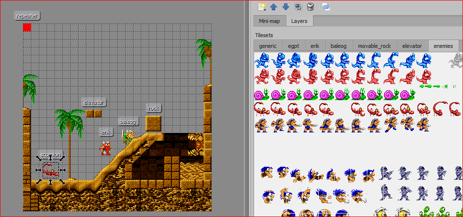
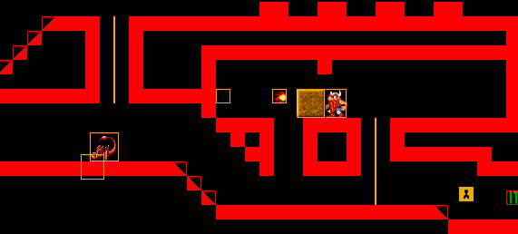
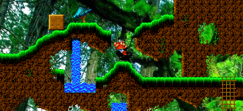

Introduction to spygame
=======================

What is spygame?
----------------

Spygame is a lightweight 2D game engine written in python3 using the pygame library. It's purpose
is to:

#. allow python enthusiasts to reverse engineer their favourite 2D classic games in python
#. support recent AI developments via integration into the openAI toolbox (gym and rllab) and thus
   allow researchers to test their reinforcement learning algorithms on complex and \"reward-sparse\" environments.
#. have fun developing new games and game genres using just python

Main Features
-------------

Simple, yet Powerful
++++++++++++++++++++

Spygame is very lightweight. It comes as a single python module that can be installed on your machine
via a simple ``pip install spygame``.

Spygame uses so called level-tmx files to allow developers to create complex game worlds using the open-source
`Tiled Editor <http://www.mapeditor.org>`_. You can build a rather complex level from scratch only needing a few
background images and sprite-sheets as prerequisites:

Built-In Complex Physics
++++++++++++++++++++++++

Spygame offers built-in complex platformer physics supporting the following features:
- tiles with arbitrary slopes (including stairs options)
- jumping
- full support for ladders
- pushable heavy objects
- elevators and moving platforms that one can stand on
- built-in game AIs (cliff- and character-detection mechanisms)

Example Levels from "The Lost Vikings" Universe
+++++++++++++++++++++++++++++++++++++++++++++++

Spygame comes with lots of fully playable example levels, mostly reverse-engineered from \"The Lost Vikings\" Game (c) 1992 Blizzard Entertainment Inc.

Support for Academic AI and Reinforcement Learning
++++++++++++++++++++++++++++++++++++++++++++++++++

This is still work in progress: Spygame will be fully integrated into the openAI gym and rllab tool sets. One of the core purposes of spygame is
to allow running reinforcement learning (AI) algorithms on different computer games in order to help the AI community to
test and improve their algorithms.

.. image:: images/intro_004_tensorlogo.png
    :scale: 60%

.. image:: images/intro_004_pytorchlogo.png
    :scale: 30%

